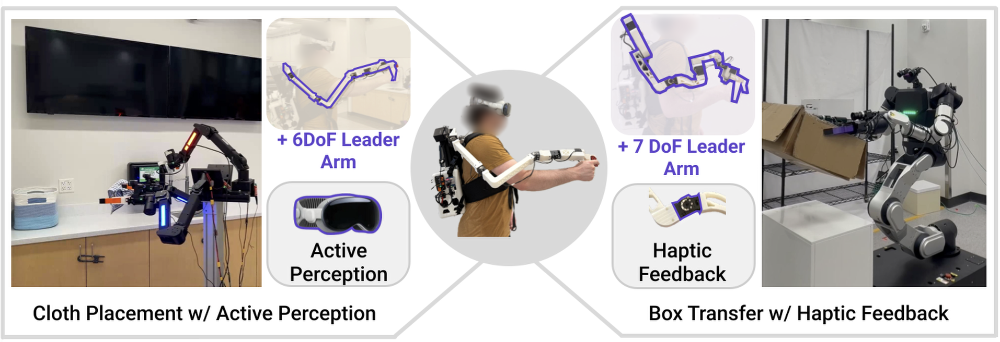
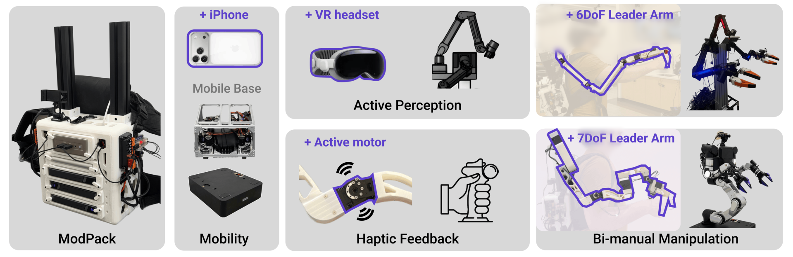
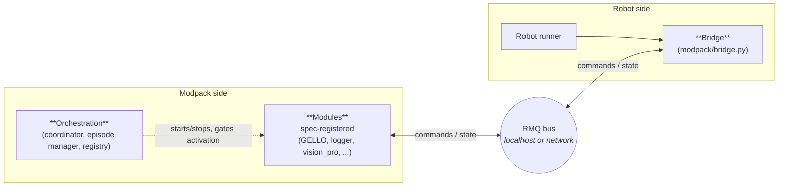

<h1 align="center">ModPack</h1>

<p align="center"><i>An Extensible Teleoperation Interface for Bimanual Mobile Manipulation.</i></p>

<p align="center">
  <a href="https://modpackteleoperation.github.io/"></a>
  <a href="https://modpackteleoperation.github.io/docs/"></a>
  
</p>

<p align="center"></p>

ModPack is an extensible teleoperation interface for mobile robots, built upon a central backpack unit that allows for interchangeable modules. This repo contains all the software needed for teleoperation and data collection with the robots discussed in the paper, namely a customized ARX5-based design as well as an RB-Y1m from Rainbow Robotics. Policy training and inference code is not included in this release. For hardware, refer to the website above.

<p align="center"></p>

<p align="center"><i>Pictured are three key modules currently written for ModPack: iPhone base tracking, active perception using a Vision Pro, and leader arms.</i></p>

---

## Supported Robots

- Custom ARX5 Mobile Robot: the ARX5-based mobile robot described in [Vision-in-Action](https://vision-in-action.github.io/), on a [TidyBot++](https://tidybot2.github.io/docs/) base. 6-DoF arms.
- RB-Y1m: Integrated mobile robot from [Rainbow Robotics](https://www.rainbow-robotics.com/en_rby1). 7-DoF arms.

---

## Hardware Quick Start 
[**Build Guide + Docs**](https://modpackteleoperation.github.io/docs/)

## Software Quick Start
**Single-PC robot (e.g. rby1):**
```bash
python -m modpack --gello --robot rby1
```

**Two-PC robot (e.g. arx5):**
```bash
# Modpack PC
python -m modpack --gello --robot arx5
# The coordinator SSHes the Robot PC and launches runner scripts automatically
# (configured via robot_pc.scripts in the robot's config.yaml)
```

Runtime logs: `/tmp/modpack_logs/`

---

## Installation

### ModPack Mini PC

Follow the [TidyBot2 software setup guide](https://tidybot2.github.io/docs/software/) and navigate to **Mini PC Setup** to configure the Mini PC, including OS installation and SSH.
> [!NOTE]
> For ModPack PC, we recommend limiting the CPU frequency given the logging load on the PC when recording episodes. We found that without this scaling, control will lag. In step 3 of the CPU frequency scaling on the TidyBot docs, run the following modified version of the command.
>
> ```bash
> sudo sh -c 'echo -e "GOVERNOR=performance\nMAX_SPEED=3000000" > /etc/default/cpufrequtils'
> ```

#### Network Setup

The Mini PC and the robot PC must be on the same network. For best performance, connect the robot to a dedicated WiFi network rather than a shared one.

### ModPack Software

Clone the repo **with submodules** and create the conda environment:

```bash
git clone https://github.com/modpackteleoperation/modpack.git
cd modpack
git submodule update --init --recursive modpack/robots/rby1

conda env create -f environment.yaml
conda activate modpack
```

### Robot Software

#### ARX5 → [modpack/robots/arx5/README.md](modpack/robots/arx5/README.md)
#### RB-Y1 → [modpack/robots/rby1/README.md](modpack/robots/rby1/README.md)

---

## Configuration

Each robot has a `config.yaml` under `modpack/robots/<name>/`:

```yaml
name: arx5
topology: managed       # or unmanaged

roles:
  right_arm: {type: joint_arm, dof: 6}
  left_arm:  {type: joint_arm, dof: 6}
  body:      {type: mobile_base}
  neck:      {type: cartesian_arm}

modules:
  - gello
  - logger
  - vision_pro
  - base

logging_streams:
  - logger_name: right_arm
    logger_type: joint_state   # joint_state | joint_command | base_state | cartesian_state
    port: 5601
    topic: right_arm
    control_freq: 100.0
    joint_dof: 6
    enabled: true
  - logger_type: camera
    camera_key: right_wrist_camera_0
    port: 5606
    width: 1280
    height: 720
    fps: 30.0
    enabled: true
```

`modules:` lists the modpack-side processes to start. `roles:` declares what the bridge expects to send/receive. `logging_streams:` is the unified list for all proprio and camera streams — both `BackpackStreamLogger` and `BackpackCameraLogger` read from it, filtered by `logger_type`.

---

## Usage

### CLI Flags
There are three main CLI flags that are important to understand when launching the system using the `modpack` command (though there are more, just less important).

- `--gello`: Indicates that we are launching from the ModPack PC
- `--robot`: Which robot you are using, can either be `rby1` or `arx5` currently
- `--vp-stream-mode`: Changes whether you see point cloud or rgb for arx5 robot, which supports both. Can be either `pcd` or `rgb`
- `--vp-bypass-neck`: Use when robot neck is integrated with robot such as RB-Y1m so activation signals still pass through
- `--pc-id`: Which PC this coordinator runs on, `gello` (default, the ModPack PC) or `robot` (the robot-side coordinator). You normally don't set this by hand, since for managed robots the robot-side coordinator is launched automatically with `--pc-id robot` via `robot_pc.scripts`.

Other, less commonly used flags (run `python -m modpack --help` for the full list): `--modules mod1,mod2` to override which modules start.

### Episode and Activation Controls
The three keys that control state transitions and episode logging once the `modpack` command is launched are *s*, *v*, and *q*.

#### Episode Control (*s* key)
| Pattern | State required | Action |
|---|---|---|
| Single tap | Idle | Start episode |
| Single tap | Active | Stop episode |
| Double tap | Active | Pause episode |
| Double tap | Paused | Resume episode |
| Triple tap | Any | Delete last episode |

#### Module Activations (*v* key)
The specific number of taps of the *v* key required to activate each module (such as leader arms, vision pro, etc) is contained within the `activation_buttons` section of each robot's `config.yaml`, where the number next to each module name is the number of quick, consecutive taps required to activate.

#### Shutdown (*q* key)
Pressing *q* at any point after launching the `modpack` command will shutdown ModPack code.

> [!WARNING]
> The code is not responsive to ctrl+c.

---

## Data collection

Episode recordings go to the path specified in `modpack_config.yaml`. Specifically, each individual episode saves to `<root_dir>/<project_name>/<task_name>/<run_name>`. To enable efficient recording on the fly and to not take up excessive space on the CPU, episode videos (such as iPhone RGB, wrist cameras, etc.) save as compressed JPEG chunks. 

Finalize the deferred video spools into `.mp4` files. Point it at a single episode or a whole run/parent dir (searched recursively):

```bash
python3 scripts/data_tools/finalize_episode_video_spools.py <root_dir>/<project_name>/<task_name>/<run_name>
```
---

## How it works

ModPack is a modular teleoperation and data-collection system. You can add a **new robot** or a **new module** without redesigning the rest of the stack. We achieve this using a three part architecture:

1. **Bridge** — SDK library robot controllers import to receive commands and publish state
2. **Modules** — self-contained modpack-side processes (GELLO leader, logger, Vision Pro)
3. **Orchestration** — lifecycle engine that starts/stops modules and manages episodes

The three parts above connect like this:



The two sides talk only through the RMQ bus. They can run on **the same machine** (single-PC, e.g. `rby1` — RMQ over `tcp://localhost`) or on **separate machines** (two-PC, e.g. `arx5` — RMQ over the network). Topology is set per-robot in `config.yaml`; nothing else changes.

The bridge is the only modpack API a robot runner imports. Orchestration never touches robot-specific code; modules never touch orchestration internals. Adding a robot or a module never requires editing the other two parts.

---

## Adding robots & modules

- **New robot** → [docs/robot_integration/ADD_A_ROBOT.md](docs/robot_integration/ADD_A_ROBOT.md)
- **New ModPack-side module** → [docs/ADD_A_MODULE.md](docs/ADD_A_MODULE.md)

---

## Repository map

```
modpack/
├── bridge.py            ← main robot-side API
├── schemas.py           ← role type contracts (joint_arm, mobile_base, …)
├── modules/             ← modpack-side processes
│   ├── gello/           ← GELLO leader arm publisher
│   ├── logger/          ← BackpackStreamLogger + BackpackCameraLogger
│   ├── vision_pro/      ← VisionPro head tracking
│   ├── base/            ← mobile base process (real or mock) + iPhone WebXR teleop
│   └── modpack_config.yaml  ← shared runtime config (RMQ host/ports, logging, runs)
├── orchestration/       ← lifecycle engine (coordinator, episode manager, registry)
├── robots/              ← robot packages (arx5, rby1)
│   └── <name>/
│       └── config.yaml  ← topology, modules, logging_streams, gello hardware config
└── utils/               ← shared utilities (DebugPrinter)

docs/
├── robot_integration/       ← ADD_A_ROBOT.md
├── ADD_A_MODULE.md          ← how to add a new modpack-side module
├── MODULE_RMQ_CHEATSHEET.md ← RMQ topic / message reference
└── README.md                ← docs index

examples/                ← minimal bridge integration examples (joint arm, sensor)
scripts/                 ← operator/dev tooling (data_tools/, calibration/)
```

---

## Citation

Citation withheld for double-blind review.

---

## Acknowledgments

Acknowledgments withheld for double-blind review.
