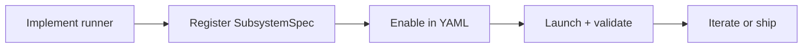

# Docs Index

Use this page to find the right guide quickly.

Module onboarding flow:

## Start Here

- Project overview and quickstart: [`../README.md`](../README.md)
- Launch commands and entrypoints: [`../modpack/__main__.py`](../modpack/__main__.py) (`python -m modpack`)
- Runtime config files: [`../modpack/modules/`](../modpack/modules/)

## Operator Guides

- Logging and episode flow internals: [`../modpack/orchestration/README.md`](../modpack/orchestration/README.md)

## Contributor Guides

- Add a new module: [`ADD_A_MODULE.md`](ADD_A_MODULE.md)
- Robot adapters and embodiments: [`../modpack/robots/README.md`](../modpack/robots/README.md)
- Debug and data utilities: [`../scripts/README.md`](../scripts/README.md)

## Related Repos

- RBY1 submodule: [modpack/robots/rby1/README.md](../modpack/robots/rby1/README.md)
